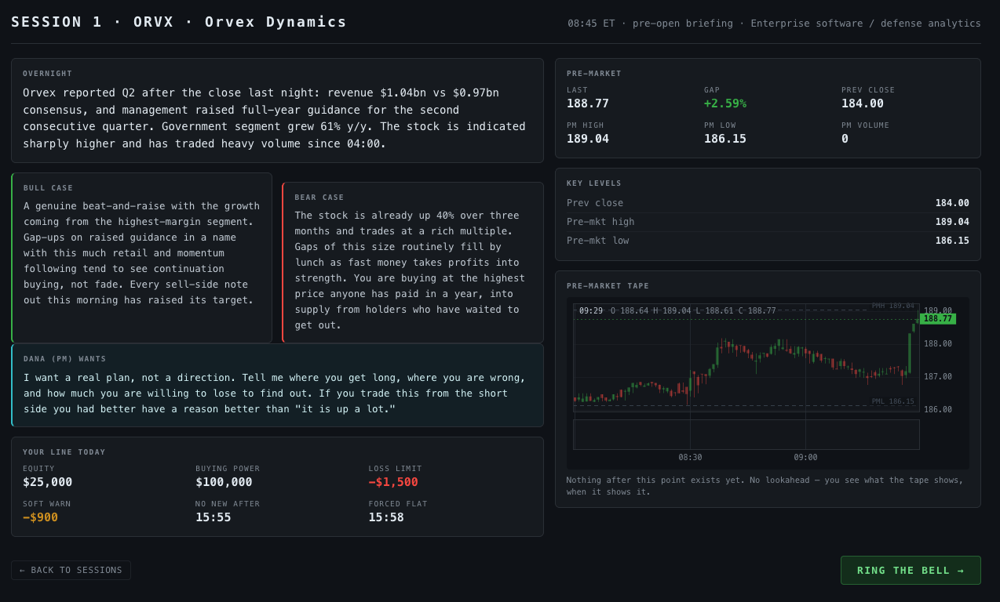
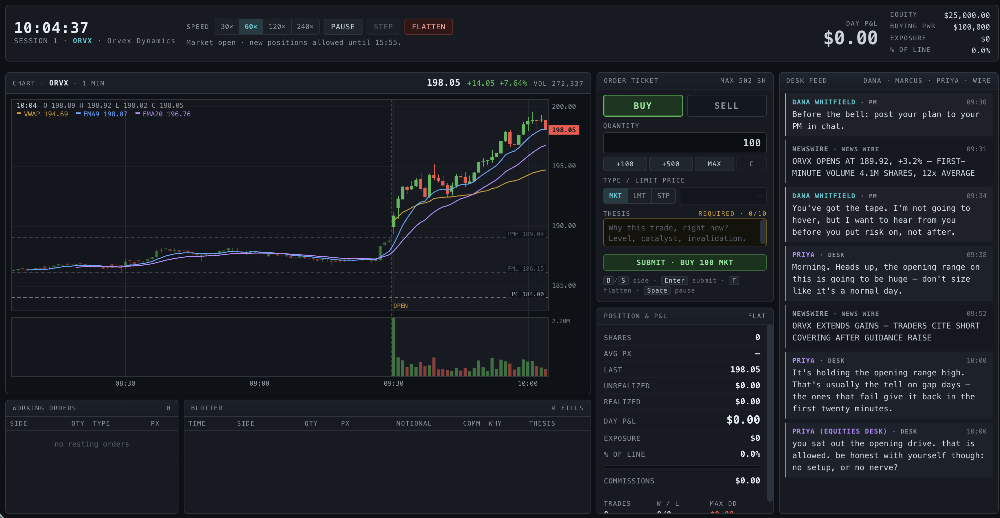

# Role Sims

**Flight simulators for judgment.**

LLMs give the vocabulary but consequence gives you instinct

Imagine you’re launching a product based on the pain points of a role such as traders. You can read about a trader’s job for a year and still have no judgment. Books and LLMs give you the vocabulary, but consequence gives you instinct and confidence to act. I think what’s missing is a flight simulator for judgment — something that takes you through the day-to-day: the Slack messages with the trader’s boss and peers, the pressures, the incentives, and the regrets.

To demonstrate that, I vibe coded a few standalone HTMLs that take you through the day-to-day of different roles, such as a Trader, a Jr. Software Engineer, a Product Manager, and an ML Researcher.

Each day starts with a briefing. There is a Slack channel showing communication with the boss and peers, and different artifacts one needs to use and a clock, emphasizing the time pressures.

And of course, a bit of a disclaimer: No guarantee these accurately capture the day-to-day experience. They can obviously be further enhanced by feedback from people in those actual roles through interviews and role plays. The intent is to share the concept.

### What it looks like

The pre-open briefing: the overnight story, the bull and bear case, your line for the day, and what your PM wants from you — before the bell, before you can trade.

The floor, live: real one-minute bars replayed with no lookahead, an order ticket that will not accept a trade without a typed thesis, and a desk that reacts to what you do — including when you do nothing.

---

## The four

| | Role | Span |
|---|---|---|
| 01 | **Day Trader** | 3 sessions, $25k |
| 02 | **ML Researcher** | 5 days, 6,000 GPU-h |
| 03 | **Product Manager** | 12 weeks, 48 eng-weeks |
| 04 | **Junior Engineer** *(pre-AI)* | 10 days, a mentor's 10 hours |

Each has a hidden ground truth you are scored against, a scarce resource, a
clock, and people who push back.

## Running them

Open `index.html` in the repo
